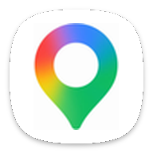

<h1> bearinmind patches</h1>

I'll continue to support patches for apps I use & apps that I get requests for (either for specific features or premium unlocking). Below is a short description of how to install my patches on morphe!

Install Morphe Manager if you have not yet: https://morphe.software

[Click here to add bearinmind patches to Morphe Manager](https://morphe.software/add-source?github=bearinmindcat/morphe-patches)

Select the app you want to patch inside Morphe Manager, follow all instructions shown.

## Patches

<!-- PATCHES_START -->
> **[v0.0.1](https://github.com/bearinmindcat/morphe-patches/releases/tag/v0.0.1)**&nbsp;&nbsp;•&nbsp;&nbsp;`main`&nbsp;&nbsp;•&nbsp;&nbsp;24 patches total

 Google Maps&nbsp;&nbsp;-&gt;&nbsp;&nbsp; Ungoogled Maps&nbsp;&nbsp;•&nbsp;&nbsp;24 patches

 

**Supported version(s):** 26.36.04.973607363

| Patch | Description | Options |
|----------|----------------|-----------|
| [Black theme](#black-theme) | AMOLED-black theme. Pins Maps' own dark mode and its separate navigation colour scheme, and remaps colour resources, drawable fills and draw-time paints so no surface is left grey. |  |
| [Blue pin](#blue-pin) | Chromium-coloured flat map pin on the launcher icon, every in-app product logo, and the search bar's leading icon. |  |
| [Bypass Play Services checks](#bypass-play-services-checks) | Maps' bundled signature verification and availability check always report success, so the app runs re-signed and with Google Play services disabled or absent. |  |
| [Change app name](#change-app-name) | Sets the launcher and in-app app name. | • App name |
| [Change package name](#change-package-name) | Installs alongside stock Google Maps under its own package name. | • Package name |
| [Customization screen](#customization-screen) | Adds a Customization row under Settings on the account sheet, hosting the toggles below. |  |
| [Hide ads](#hide-ads) | Hides promoted map pins and "Sponsored" search result rows. |  |
| [Hide explore feed](#hide-explore-feed) | Hides the home tab's Explore feed sheet ("Local vibe"). |  |
| [Hide navigation tabs](#hide-navigation-tabs) | Hides the Explore / Contribute / You strip at the bottom of the home screen. |  |
| [Hide section title](#hide-section-title) | Removes the "More from this app" label from the account sheet. |  |
| [Hide sign-in button](#hide-sign-in-button) | Removes the "Sign in" pill from the account sheet entirely. |  |
| [Keep account sheet open](#keep-account-sheet-open) | Returning from Settings or Customization no longer dismisses the account sheet underneath. |  |
| [Legacy icon](#legacy-icon) | Restores the pre-2025 flat pin launcher icon, lifted from an older Maps APK at build time. | • Source APK |
| [Location provider toggle](#location-provider-toggle) | Adds a "Google Play location" switch. Off uses Android's own location providers only. |  |
| [Network location fallback](#network-location-fallback) | Keeps the network (Wi-Fi/cell) provider registered when no Play services fused provider answers, so a fix does not go stale indoors. |  |
| [Rectangle shapes](#rectangle-shapes) | Squares off rounded corners across the UI, including the two round navigation controls whose face is a bitmap rather than a radius. |  |
| [Remove login promo](#remove-login-promo) | Drops the first-launch "Make it your map" page. |  |
| [Remove sign-in promo](#remove-sign-in-promo) | Removes the search screen's "Tired of typing?" card. |  |
| [Remove telemetry](#remove-telemetry) | Kills the Firebase Installations registration, the gmscompliance check-in and the ad-impression beacons. |  |
| [Restore map data](#restore-map-data) | Spoofs the package and certificate gRPC headers and stops the remaining identity check from crashing the app, so tiles, search and routing work on a re-signed build. |  |
| [Sign-in toast](#sign-in-toast) | The "Sign in" pill shows a "Can't sign in" toast instead of failing silently. |  |
| [Trim account menu](#trim-account-menu) | Removes Your Timeline, Location sharing, Your data in Maps and Help & feedback from the account sheet. |  |
| [Your profile toast](#your-profile-toast) | Tapping "Your profile" shows a "Can't sign in" toast instead of opening nothing. |  |
| [Zoom controls in navigation](#zoom-controls-in-navigation) | Adds +, − and reset tiles during turn-by-turn that change the navigation zoom while the camera keeps following the car. |  |

<!-- PATCHES_END -->

## Building

To build bearinmind patches, follow the [Morphe documentation](https://github.com/MorpheApp/morphe-documentation).

## Want more patches & features?

Open up an issue request and I'll do my best to fulfil your feature ideas for any specific apps you ask for, I enjoy working on random things so just ask!

